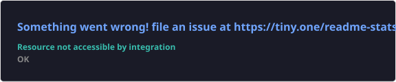

# Hi there 👋 I'm Yash Bhosale

### SAP Generative AI Engineer | SAP BTP Developer | AI Engineer

Building Enterprise AI applications using SAP BTP, RAG, LLMs and Agentic AI.

---

# 🚀 About Me

I'm a **SAP Generative AI Engineer** passionate about building production-ready Enterprise AI systems.

Currently exploring:

- 🤖 Agentic AI
- 🧠 Large Language Models
- 🔍 Retrieval Augmented Generation
- ☁ SAP AI Core
- ⚡ SAP AI Launchpad
- 🌐 SAP CAP
- ☁ SAP BTP
- 🐳 Docker
- 🐍 Python

Outside work:

- 📚 Reading AI papers
- 🏸 Playing badminton
- 🎬 Watching anime
- 💻 Building side projects

---

# 🛠 Tech Stack

## AI

LLMs • LangChain • LangGraph • Ollama • HuggingFace • RAG • Agentic AI

---

## SAP

SAP BTP • CAP • SAP AI Core • SAP AI Launchpad • HANA Cloud • Kyma • SAP Fiori

---

## Development

---

# 🌟 Featured Work

<table>
  <tr>
    <td width="50%" valign="top">
      <h3>🤖 CAPM-RAG</h3>
      
Enterprise retrieval-augmented generation solution built with SAP CAP.

      SAP CAP · RAG · LLMs · SAP BTP
    </td>
    <td width="50%" valign="top">
      <h3>🚀 CSR-Agent</h3>
      
AI-powered enterprise assistant designed for practical business workflows.

      Agentic AI · LLMs · Enterprise AI
    </td>
  </tr>
  <tr>
    <td width="50%" valign="top">
      <h3>🔍 Similarity Search</h3>
      
Semantic search experience powered by SAP AI Core.

      SAP AI Core · Embeddings · Vector Search
    </td>
    <td width="50%" valign="top">
      <h3>☁ CAPM PostgreSQL</h3>
      
SAP CAP application using PostgreSQL on a hyperscaler-ready architecture.

      SAP CAP · PostgreSQL · Cloud
    </td>
  </tr>
</table>

  <a href="https://github.com/yashbhosale789?tab=repositories">Explore all projects on GitHub →</a>

---

# 🧭 What I'm Building

I’m focused on enterprise AI experiences that connect SAP business processes with RAG, LLMs, and agentic workflows.

**Open to collaborating on:** SAP BTP applications, SAP CAP services, enterprise RAG, and practical AI agents.

---

# 📊 GitHub Statistics

---

# 🔥 GitHub Streak

<!-- Heroku-hosted streak stats sometimes go down. Using an alternative public host. -->

---

# 📈 Contribution Graph

---

# 🏆 GitHub Trophies

---

# 🐍 Contribution Snake

<picture>
  <source media="(prefers-color-scheme: dark)" srcset="https://raw.githubusercontent.com/yashbhosale789/yashbhosale789/output/github-contribution-grid-snake-dark.svg"/>
  <source media="(prefers-color-scheme: light)" srcset="https://raw.githubusercontent.com/yashbhosale789/yashbhosale789/output/github-contribution-grid-snake.svg"/>
  
</picture>

---

# 🌱 Currently Learning

- Agentic AI
- Multi-Agent Systems
- SAP Joule
- Model Context Protocol (MCP)
- LangGraph
- CrewAI
- AI Engineering
- Enterprise AI Architecture

---

# 🎯 2026 Goals

- 🚀 Become an Enterprise AI Architect
- ⭐ Contribute more to Open Source
- 🤖 Build Production AI Agents
- 📚 Publish AI Projects
- ✍ Write Technical Blogs

---

### Thanks for visiting! ⭐

